# User Guide
# About server
* Operating system: Debian 9
* RAM 128 GB
* Intel Core i9-9960X 
* GPU NVIDIA GeForce RTX 2080 Ti

# Account Creation
To use the Discovery server you must have an active account. To do this, you have to send an e-mail to lech <dot> madeyski <at> pwr <dot> edu <dot> pl and provide the following information:
1. Justification for what reason the computing power is needed
2. Project title
3. Short project description
4. Project duration
5. Nature and size of data

If your request is approved, you will be able to enjoy high-performance computing unit. Finally as an e-mail response you will be provided with credentials to your pr account. **The user's default password is the intex number.** From this moment you are fully responsible for your account and the data you store there.

# Getting Started
## Interfaces
Using the Discovery server is possible using two interfaces: 
* Website (recommended)
* Termial

### Website (recommended)
* *JupyterLab* (http://156.17.128.168/jupyterhub) - is a web-based interactive development environment for Jupyter notebooks, code, and data. All development work can be done via the browser. You can work from multiple devices without installing any external software. Before starting the project, a setup via a terminal is required.

### Termial
* *SSH* (username@156.17.128.168:22) - network protocol for operating network services. You can connect to any account via SSH protocol and perform commands from the command line. You can also connect PyCharm Professional software via SSH by setting up a remote environment that allows you to prepare and maintain the code locally in the IDE but run it remotely.

## Project setup
Regardless of the channel you choose, you must setup a project. This step must be done via the console. 
### Log in to the server
Using your individual credentials log in to the server using SSH protocol on port 22. For Linux and macOS users the default consoles can be used while Windows users should install first MobaXterm or Putty SSH clients.
#### Linux and macOS users (eg. termianl)
```bash
ssh jkowalsk@156.17.128.168
```
#### Windows users (eg. MobaXterm)

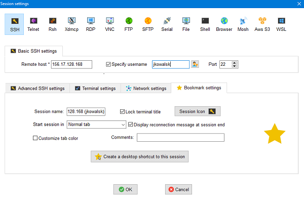
### Install Miniconda 
Miniconda is a free minimal package manager. We need to install the Miniconda package manager in order to avoid using the default instance of Python interpreted and to have **fully customized and manageable environment** where we can create multiple projects using multiple versions of the same libraries. Answer YES to questions asked by the installer. In this step, we will install the Linux version of Miniconda because the server operating system is Debian.
```bash
cd ~
wget https://repo.anaconda.com/miniconda/Miniconda3-latest-Linux-x86_64.sh
chmod 755 Miniconda3-latest-Linux-x86_64.sh
./Miniconda3-latest-Linux-x86_64.sh
```
Package manager is already installed and now you can add delete environment.
Before you do this, you must reload the system variables to enable Miniconda.
```bash
source ~/.bashrc
```
When you reload a context you'll see that you are currently using the default (base) python environment, eg. `(base) jkowalsk@discovery:~`

### Create Conda environment
When creating a new environment, you can specify the project name and Python version. Instead of `myenv` please enter your project name. Only the necessary dependencies will be installed. All additional libraries, e.g. numpy, tendorflow must be manually installed in next steps.

```bash
conda create -n myenv python=3.7
```
### Show Conda environments
When you enter the following command a list of environments and their names will be displayed.
```bash
conda info --envs
```

### Activate environemnt
To perform operations eg. run a script in the environment via termianl, you must activate the proper environemnt. Instead of `myenv` please enter your project name.
```bash
conda activate myenv
```

## Checkout your Git repository on your remote machine
To work on your own project, create a git repository on GitHub (if you haven't already done) and clone it via console to your home directory. Instead of `myenv`, `jkowalsk` and `myproject` please enter your data. Before you start, make sure you have active session for your conda environment.
```bash
cd ~
conda activate myenv
git clone https://github.com/jkowalsk/myproject.git
```


## Working in JupyterLab (recommended)
JupyterLab is one of two options for using the compute unit. All you need is a browser - everything else is in the cloud.

### Prerequisite
* Conda environemnt has been created
* Open SSH sesssion using your credentials

If you want to develop the code using JupyterLab, you need to register first the environment to make it visible on the website.
### Open JupyterLab and Launch Server
Enter the http://156.17.128.168/jupyterhub URL address and provide your credentions.

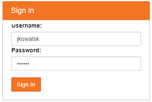

If the server is not running, click `Launch Server`.

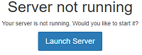

The Launcher section will be so far empty.

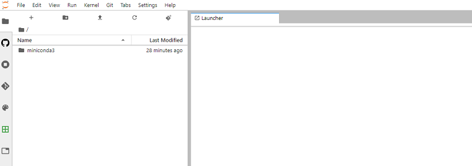

### Register the environemnt in JupyterLab
Instead of `myenv` and `Python 3 (myenv)` please enter your project key and project name.
```bash
conda activate myenv
pip install ipykernel
python -m ipykernel install --user --name myenv --display-name "Python 3 (myenv)"
```

### Refresh JupyterLab website
After refreshing the JupyterLab dashboard (F5) the newly added environemnt should be visible.

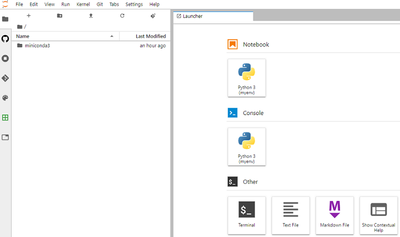

### Enjoy woring in JupyterLab
1. In the left menu the newly cloned project direstory should be visible.
2. **Create new Notebook (.ipynb) file (or open an existing one) and use JupyterLab editor to conduct your research.**

## Working in PyCharm Professional
This setup allows you to create code locally in PyCharm, while all executable processes are on the server (remote environment).

### Prerequisite
* Conda environemnt has been created
* PyCharm Professional is installed locally.

### Checkout your Git repository on your local machine 
Go to your favorite location on local machine and clone the project repository (the same one you already cloned on the remote machine ealier). Instead of `jkowalsk` and `myproject` please enter your data.
```bash
git clone https://github.com/jkowalsk/myproject.git
```
Now, the most important point is the synchronized file exchange between those two repositories (remote and local), and the connection of the local PyCharm instance with the remote environment.

### PyCharm Remote Environment setup
Open PyCharm Professional app on your local computer. Go to:
```
File --> Settings --> Project: <name> --> Project Interpreter
```
Click the gear icon, and choose `Add`, choose `SSH Interpreted` and fill in all neeeded information in `New server configuration`.


Enter your password.

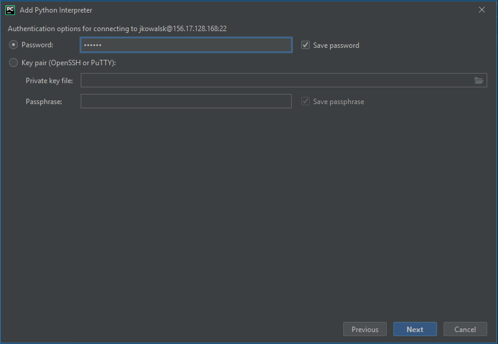

Now it need to set the correct path to Python interpreters dedicated for the given remote environment.
Open a terminal, log in to the *Discovery* server and check the correct path. Please, be sure your proper environment has been activated.
```bash
conda activate myenv
which python
```
Copy the output path eg. `/home/jkowalsk/miniconda3/envs/myenv/bin/python`. Please make sure there are no empy spaces before and after the path.

Paste the link to the lcoal PyCharm (Field `Interpreter`).

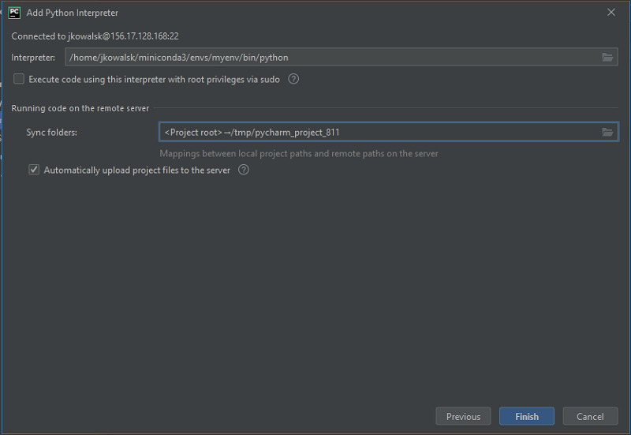

When the correct path to the interpreter is set, it is necessary to pair local and remote folders so that they can synchronize each other.
Set up `Sync folders` field in the second part of the popup. In the `Local Path` column leave the path to the current directory PyCharm works in, while in the `Remote Folder` column select the remote directory your git repository has been cloned to.

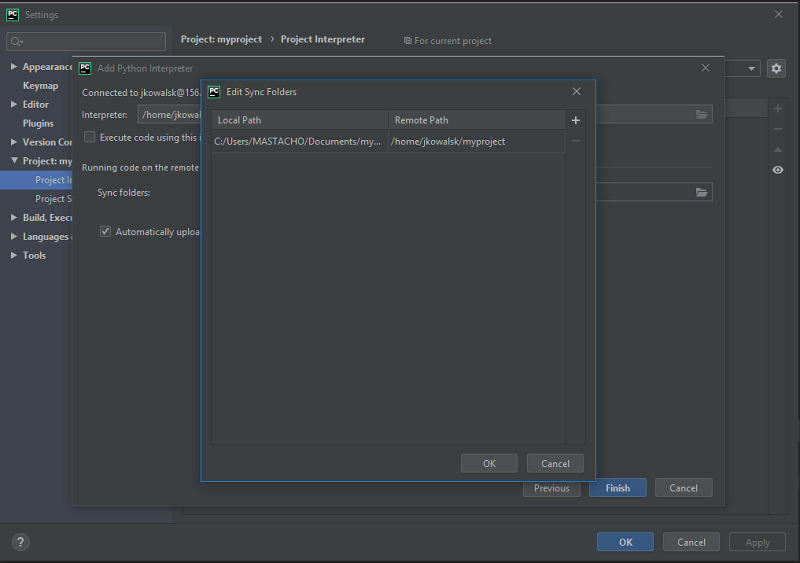

Please make sure the `Automatically upload project files to the server`.

Click `Finish`. If PyCharm will ask you if you'd wike to override files in the current remote directory (you didn't make any changes there) select `Override`.

Every time you add a new file or change an existing one, it will be automatically uploaded to the remote server. You can show log and check the progress using the `File Transfer` console.
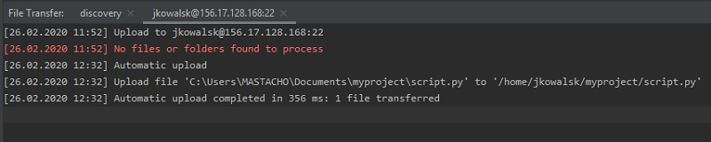

In case you need to manually synchronize data between locations, you can force it manually using the option `Tools --> Deployment --> *`

Now, when running or debugging please make sure you chose the proper remote environment to run scripts on.

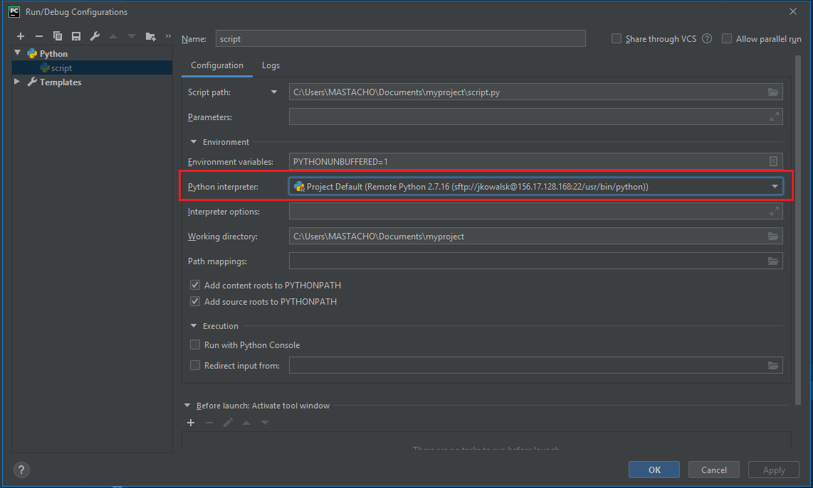

# Customization
## Installing additional Python libraries
As a person working on a research project, you need to use selected libraries. 
Regardless of the method of python library installation, this should be done on the Miniconda environment created earlier. There are generally three methods for installing libraries:
### Via terminal
Log in to the server, activate your environment and install the library in the environment using the `conda` or `pip` command. Please, be sure your proper environment has been activated.
```bash
conda activate myenv
pip install <library_name>
```
### Via JupyterLab
Any command that works at the command-line can be used in IPython (JupyterLab) by prefixing it with the `!` character. For example, the `ls`, `pwd`, and `echo`. What you need is only open a notebook in JupyterLab, choose the proper environemnt in a combo-box and enter:
```bash
!pip install <library_name>
```
### Via PyCharm
Before you install some new libraries you have to refresh/synchronize the project. 

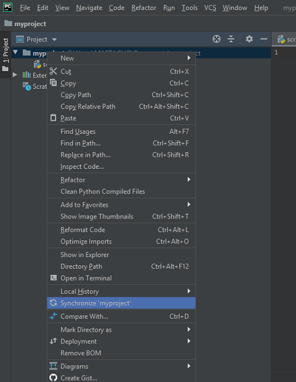

Then open the interpreter settings `File --> Settings --> Project Interpreter` and install selected library.
